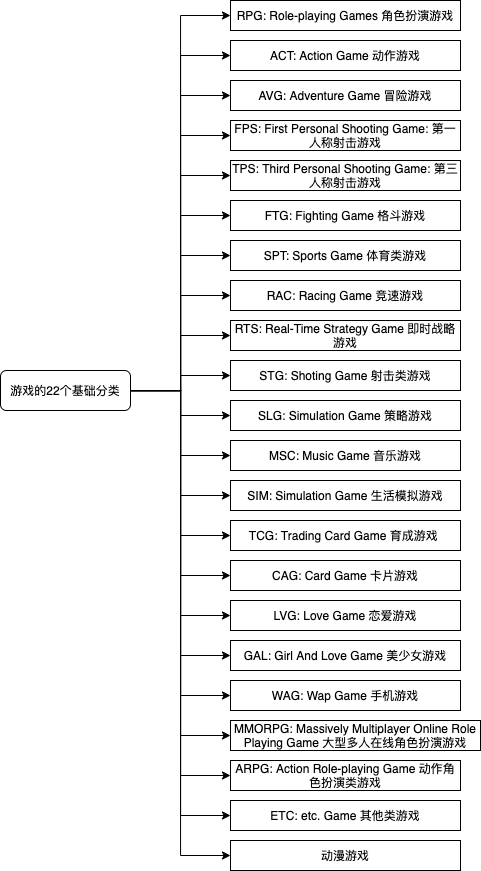
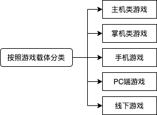
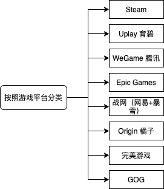
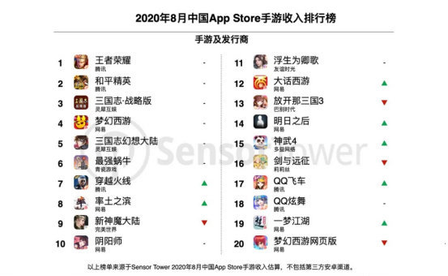
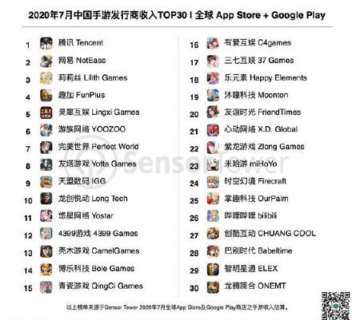
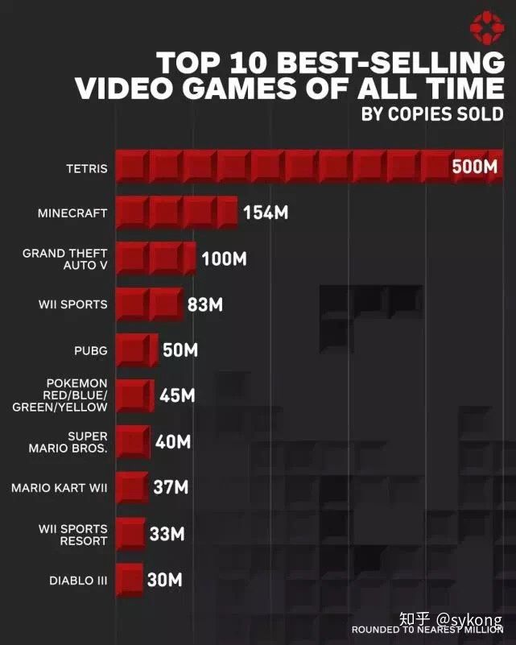
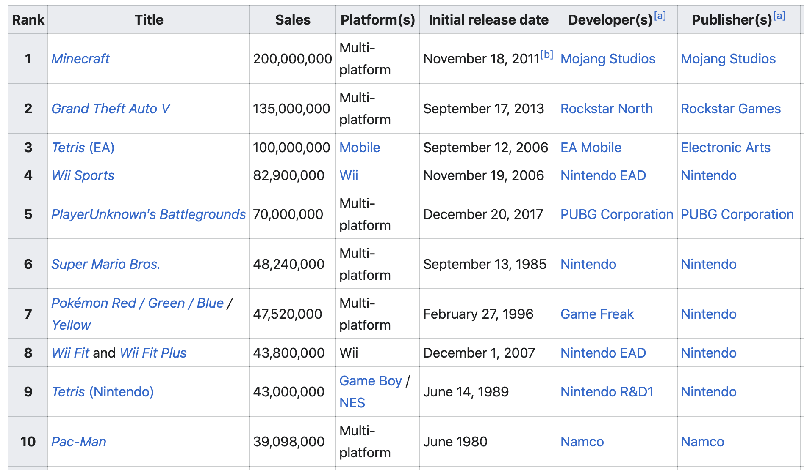

# 作业1:游戏分类与热点探索

作业内容：游戏分类与热点探索

- 使用思维导图描述游戏的分类。（游戏分类方法特别多）
- 结合手机游戏市场的下载量与排名等数据，结合游戏分类图，描述游戏市场的热点。

## 游戏分类

### 游戏的22个基础分类

### 按照游戏载体分类

### 按照游戏平台分类

## 游戏市场的热点

###手机游戏市场情况

**2020年8月中国App Store手游收入排行榜：**

**App Store实时手游下载榜单，截图于2020-09-09：**

**2020年7月中国手游发行商收入TOP30:**

**手游市场热点：**

通过上面的各种榜单，不难看出腾讯和网易两大公司在手游市场一骑绝尘，腾讯主要以《王者荣耀》、《和平精英》以及《穿越火线》等占据了手游市场的大部分玩家资源；而网易则以《阴阳师》、《梦幻西游》等游戏紧随其后。

分析排行榜前列的游戏，可以发现MOBA类对战游戏、移动射击类游戏、大逃杀类游戏、角色扮演、休闲、棋牌类手机游戏更受玩家的青睐。除此之外，近些年各类大IP下的手游也备受瞩目，各类小说、动漫等主题游戏也颇受欢迎。

上图主要为中国手游的情况，实际上不同地区的手游热度也较为不同；如在日本，二次元主题的角色扮演游戏才是占据了市场的主要游戏类型；而在欧美阿拉伯等国家，《万国觉醒》这样的策略类游戏近几年吸引了大批玩家。

**游戏市场热点：**

**List of best-selling video games **([点击](https://en.m.wikipedia.org/wiki/List_of_best-selling_video_games)查看完整TOP50榜单)

