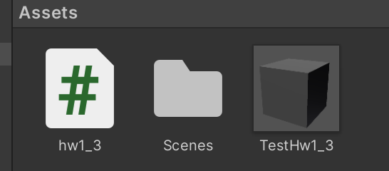
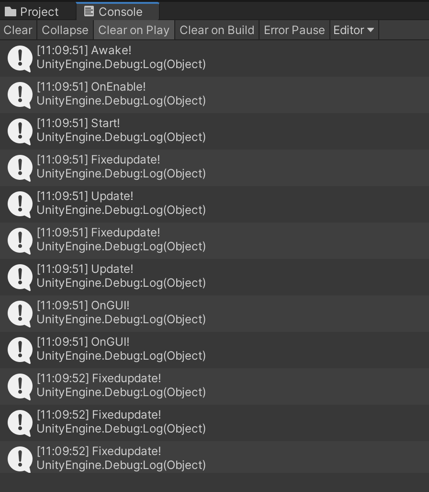
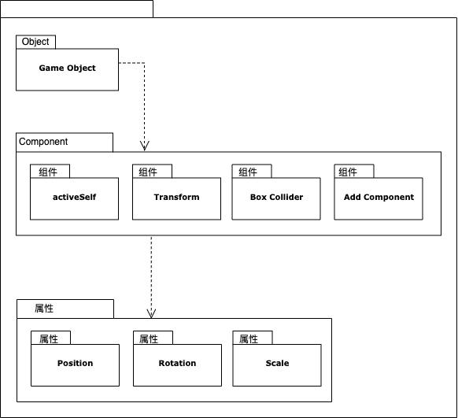
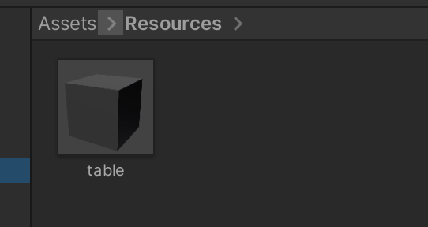
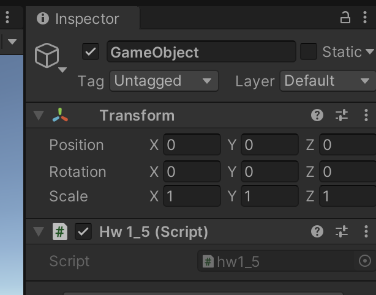
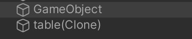
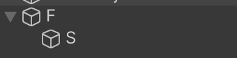
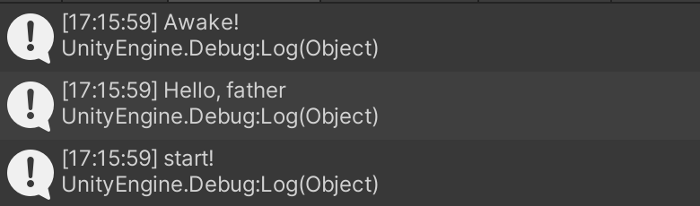

# 作业2：简答题、编程实践（简单计算器）、思考题

## 1、简答题

- **解释 游戏对象（GameObjects） 和 资源（Assets）的区别与联系。**

  - 区别：

    游戏对象 (GameObjects)：指的是一个能够容纳实现实际功能的组件。游戏中的每个对象都是一个游戏对象 (GameObject)。然而，游戏对象本身不做任何事情。它们需要特殊属性 (special properties) 才能成为一个角色、一种环境或者一种特殊效果。

    资源(Assets)：指游戏中需要的资源，项目文件中所堆放的资源，比如模型、声音文件、贴图文件等等。

  - 联系：游戏对象是由资源实例化后的对象。资源可以作为模板，实例化成具体的游戏对象，也可以作为游戏对象中的某种属性，同时也可以被多个游戏对象同时使用。

  

- **下载几个游戏案例，分别总结资源、对象组织的结构（指资源的目录组织结构与游戏对象树的层次结构）**

  * 资源的目录组织结构：包括预制、脚本等，并将其按照文件的类型分配到不同的文件夹以便管理。

  * 游戏对象树的层次结构：包括游戏环境的设置（如摄像机，开始位置，场景布局）、游戏的控制、玩家以及目标等。

    

- **编写一个代码，使用 debug 语句来验证 MonoBehaviour基本行为或事件触发的条件**

  - 基本行为包括 Awake() Start() Update() FixedUpdate() LateUpdate()

  - 常用事件包括 OnGUI() OnDisable() OnEnable()
  - awake：当一个脚本实例被载入时被调用
    - start：在所有update函数之前被调用一次
    - update：当行为启用时，其update在每一帧被调用
    - fixedupdate：当行为启用时，其fixedupdate在每一时间片被调用
    - OnGUI：渲染和处理GUI事件时调用
    - OnEnable：当对象变为可用或激活状态时被调用
    - OnDisable：当对象变为不可用或非激活状态时被调用

  ```csharp
  using System.Collections;
  using System.Collections.Generic;
  using UnityEngine;
  
  public class hw1_3 : MonoBehaviour
  {
      private void Awake()
      {
          Debug.Log("Awake!");
      }
   
      void Start () {
          Debug.Log("Start!");
  		}
  	
      void Update () {
          Debug.Log("Update!");
  		}
   
      private void FixedUpdate()
      {
          Debug.Log("Fixedupdate!");
      }
   
      private void OnGUI()
      {
          Debug.Log("OnGUI!");
      }
   
      private void OnDisable()
      {
          Debug.Log("OnDisable!");
      }
   
      private void OnEnable()
      {
          Debug.Log("OnEnable!");
      }
  }
  
  ```

  实现方式：

  

  Console输出：

  

  

- **查找脚本手册，了解GameObject，Transform，Component 对象**

  - 分别翻译官方对三个对象的描述（Description）

    - GameObject：是一个类型，所有的游戏物件都是这个类型的对象
    - Transform：是一个类，用来描述物体的位置，大小，旋转等等信息
    - Component：是用来绑定到Game Object上的一组相关属性。本质上每个组件是一个类的实例

  - 描述下图中 table 对象（实体）的属性、table 的 Transform 的属性、 table 的部件

    (本题目要求是把可视化图形编程界面与 Unity API 对应起来，当你在 Inspector 面板上每一个内容，应该知道对应 API。例如：table 的对象是 GameObject，第一个选择框是 activeSelf 属性。)

    * 第一个选择框是activeSelf：可以定义对象的名称，动静态等属性
    * 第二个选择框是Transform：可以定义对象的位置、面向方向、大小
    * 第三个选择框是Box Collider：可以调整坐标系的位置、大小
    * 第四个选择框是Add Component：可以给对象增加行为

  - 用 UML 图描述 三者的关系（请使用 UMLet 14.1.1 stand-alone版本出图）

    

    

- **资源预设（Prefabs）与 对象克隆 (clone)**

  - 预设（Prefabs）有什么好处？

    1. 它可以被置入多个场景中，也可以在一个场景中多次置入。

    2. 当你在一个场景中增加一个Prefabs，你就实例化了一个Prefabs。

    3. 所有Prefabs实例都是Prefab的克隆，所以如果实在运行中生成对象会有(Clone)的标记。

    4. 只要Prefabs原型发生改变，所有的Prefabs实例都会产生变化。

       

  - 预设与对象克隆 (clone or copy or Instantiate of Unity Object) 关系？

    克隆是将已经存在的游戏对象或资源当中的预设进行复制。克隆可以是对已经添加在视图当中的游戏对象进行复制，也可以是对资源当中提前预设好的模板进行克隆。

    预设一般来说是克隆的一个基础步骤，在预设之后，就可以在资源当中随心所欲地为自己想要的对象进行克隆了。

    

  - 制作 table 预制，写一段代码将 table 预制资源实例化成游戏对象

    首先在Assets下新建Recources文件夹，并制作出预制table放在Recource下:

    

    代码如下，然后将其挂在一个新建的游戏对象上：

    ```csharp
    using System.Collections;
    using System.Collections.Generic;
    using UnityEngine;
    
    public class hw1_5 : MonoBehaviour
    {
        void Start () {
            Debug.Log("start!");
            GameObject table = Resources.Load("table") as GameObject;
            Instantiate(table);
     
            table.transform.position = new Vector3(0, Random.Range(5, 7), 0);
            table.transform.parent = this.transform;
    	}
    	
    	void Update () {
    		
    	}
    }
    ```

    

    最终结果：

    


## 2、 编程实践，小游戏

- 游戏内容： 井字棋 或 贷款计算器 或 简单计算器 等等
- 技术限制： 仅允许使用 **[IMGUI](https://docs.unity3d.com/Manual/GUIScriptingGuide.html)** 构建 UI
- 作业目的：了解 OnGUI() 事件，提升 debug 能力；提升阅读 API 文档能力


### 简单计算器


## 3、思考题

- 微软 XNA 引擎的 Game 对象屏蔽了游戏循环的细节，并使用一组虚方法让继承者完成它们，我们称这种设计为“模板方法模式”。为什么是“模板方法”模式而不是“策略模式”呢？

  - 模板方法模式：在模板模式（Template Pattern）中，一个抽象类公开定义了执行它的方法的方式/模板。它的子类可以按需要重写方法实现，但调用将以抽象类中定义的方式进行。这种类型的设计模式属于行为型模式。
  - 策略模式：在策略模式（Strategy Pattern）中，一个类的行为或其算法可以在运行时更改。这种类型的设计模式属于行为型模式。在策略模式中，我们创建表示各种策略的对象和一个行为随着策略对象改变而改变的 context 对象。策略对象改变 context 对象的执行算法。

  模板方法更加注重定义一个算法流程，且这个流程上的多个点是可以变化的，算法流程只有唯一的入口，对于点的访问是受限的；而策略模式中，一个策略是一套完整的算法，算法是可以被整体替换的。而模板方法只能被替换其中的特定点，算法流程是固定不可变的。

  

- 将游戏对象组成树型结构，每个节点都是游戏对象（或数）。
  - 尝试解释组合模式（Composite Pattern / 一种设计模式）。
  
    组合模式（Composite Pattern），又叫部分整体模式，是用于把一组相似的对象当作一个单一的对象。组合模式依据树形结构来组合对象，用来表示部分以及整体层次。这种类型的设计模式属于结构型模式，它创建了对象组的树形结构。
  
    这种模式创建了一个包含自己对象组的类。该类提供了修改相同对象组的方式。
  
  - 使用 BroadcastMessage() 方法，向子对象发送消息。你能写出 BroadcastMessage() 的伪代码吗?
  
    代码如下：
  
    ```csharp
    public class Father : MonoBehaviour {
       
       void Start () {
       	this.BroadcastMessage("test");
       }
       	
       void Update () {
       		
       }
    }
    ```
  
    
  
    ```csharp
    public class Son : MonoBehaviour {
    
       void Start () {
       	
       }
       	
       void Update () {
       	
       }
    
       void test(){
       	Debug.Log ("Hello, father");
       }
    }
    ```
  
    分别将Father、Son拖到对应的对象中：
  
    
  
    运行后Console输出：
  
    


- 一个游戏对象用许多部件描述不同方面的特征。我们设计坦克（Tank）游戏对象不是继承于GameObject对象，而是 GameObject 添加一组行为部件（Component）。
  - 这是什么设计模式？ 装饰模式
  
  - 为什么不用继承设计特殊的游戏对象？
  
    如果用继承方式，将使代码耦合性高而内聚性低。在游戏调试过程中，往往需要频繁变动组件，如果使用继承设计，将使得调试变难。


**本次作业源码：**

[计算器]()

[其他题目中测试部分代码]()


参考博客：

[3D游戏编程与设计第一次作业](https://blog.csdn.net/gzx1002/article/details/100623692)

