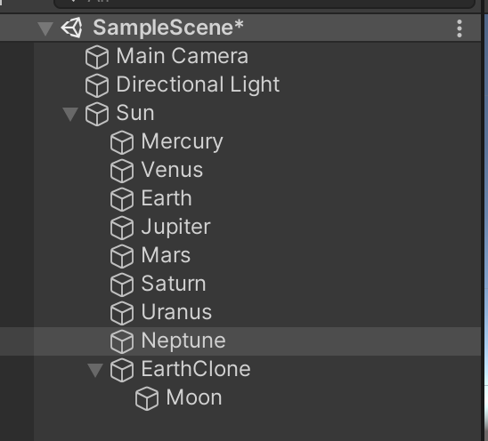
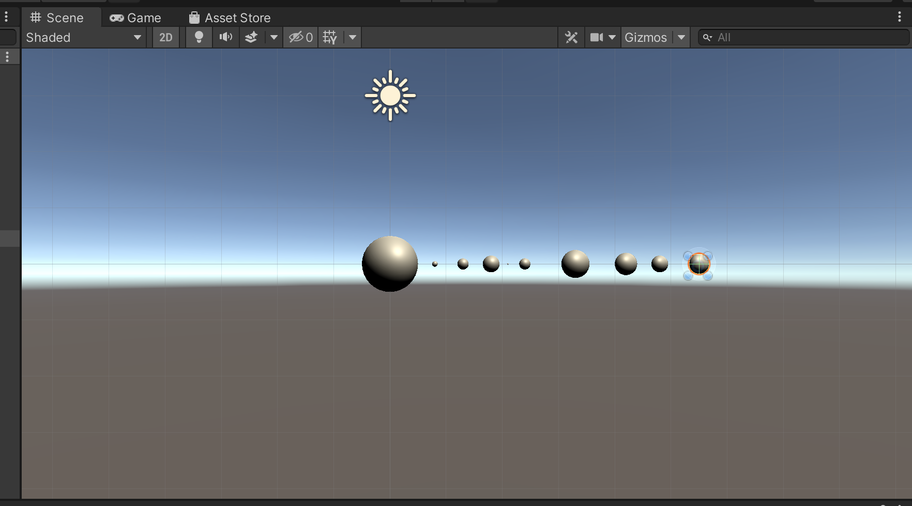
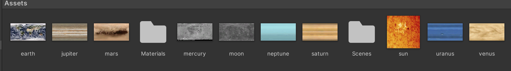
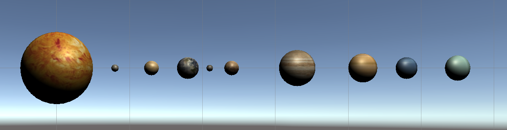
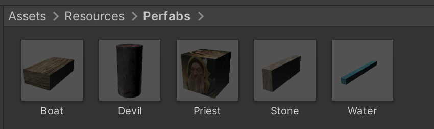
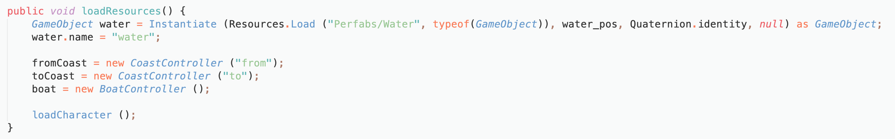

# 作业3: 简答、编程实践

本次作业中涉及到的代码：

[太阳系](https://github.com/wangw42/wJuniorHomework/tree/master/3DGame/hw03)

[牧师与魔鬼](./hw03_PriestsAndDevils)


## 简答

1、简答并用程序验证

- 游戏对象运动的本质是什么？

  游戏对象运动的本质，其实是游戏对象跟随每一帧的变化而产生空间上的变化。这里的空间变化包括了游戏对象的transform属性中的position跟rotation两个属性。一个是绝对或者相对位置的改变，一个是所处位置的角度的旋转变化。

- 请用三种方法以上方法，实现物体的抛物线运动。（如，修改Transform属性，使用向量Vector3的方法…）

  以下三个方法分别是用：

  1. 通过修改transform的position属性实现
  2. 通过修改向量Vector3实现
  3. 通过利用transform中的translate函数来改变position实现

  ```csharp
  public class movePosition : MonoBehaviour {
   
      public float speed = 1;
    
  		void Start () {
        
  		}
  	
  		void Update () {
   
          this.transform.position += Vector3.down * Time.deltaTime * (speed/10);
          this.transform.position += Vector3.right * Time.deltaTime * 5;
          speed++;
  		}
  }
  
  public class moveVector : MonoBehaviour {
   
      public float speed = 1;
  		void Start () {
      
  		}
  	
  		void Update () {
   
          Vector3 change = new Vector3( Time.deltaTime*5, -Time.deltaTime*(speed/10), 0);
          ;
          this.transform.position += change;
          speed++;
  		}
  }
  
  public class moveTranslate : MonoBehaviour {
   
      public float speed = 1;
  		void Start () {
          
  		}
  	
  		void Update () {
   
          Vector3 change = new Vector3(Time.deltaTime * 5, -Time.deltaTime * (speed / 10), 0);
   
          transform.Translate(change);
          speed++;
      }
  }
  ```


​		

- 写一个程序，实现一个完整的太阳系， 其他星球围绕太阳的转速必须不一样，且不在一个法平面上。

  * 首先创建游戏对象，即太阳、 八大行星和月亮

    

  * 然后调整他们的大小和位置，为了便于观察，可以切换成2D模式

    

  * 去网上下载对应的贴图，并将图片素材拉到游戏对象上

    

    

  * 最后写代码，将脚本挂载到sun上面即可，代码的思路以及实现如下：

    * 将代码仅挂到Sun上，那么就需要GameObject.Find()函数寻找到各游戏对象；
    * 游戏对象的运动（包括自转和公转）则通过transform函数中的RotationAround和Rotate函数实现
    * public void RotateAround(Vector3 point, Vector3 axis, float angle); point:要围绕的点； axiw:要围绕的轴，如x,y,z angel:旋转的角度  
    * Rotation函数则可以只需要一个参数，即旋转时的方向及速度，用Vector3.up代表该物体是沿着自己的Y轴进行旋转的，后面的参数则是代表旋转的角速度，因此即可实现自转
    * 月球由于挂在地球下，如果直接写的话，地球的自转会影响月球的公转；因此通过创建EarthClone来解决，EarthClone保持和Earth重叠，但不自转，而Moon挂在EarthClone下并围绕其公转

  ```csharp
  void Update()
      {
          GameObject.Find("Sun").transform.Rotate(Vector3.up * Time.deltaTime * 5 );
  
          GameObject.Find("Mercury").transform.RotateAround(Vector3.zero, new Vector3(0.1f, 1, 0), 60 * Time.deltaTime);
          GameObject.Find("Mercury").transform.Rotate(Vector3.up * Time.deltaTime * 1 / 58);
  
          GameObject.Find("Venus").transform.RotateAround(Vector3.zero, new Vector3(0, 1, -0.1f), 55 * Time.deltaTime);
          GameObject.Find("Venus").transform.Rotate(Vector3.up * Time.deltaTime * 10 / 243);
          // 让Moon围绕着没有自转的EarthClone公转，EarthClone与Earth重叠
          GameObject.Find("Earth").transform.RotateAround(Vector3.zero, new Vector3(0, 1, 0), 50 * Time.deltaTime);
          GameObject.Find("Earth").transform.Rotate(Vector3.up * Time.deltaTime * 10);
          GameObject.Find("EarthClone").transform.RotateAround(Vector3.zero, new Vector3(0, 1, 0), 50 * Time.deltaTime);
          GameObject.Find("Moon").transform.RotateAround(GameObject.Find("EarthClone").transform.position, new Vector3(0, 1, 0), 250 * Time.deltaTime);
          GameObject.Find("Moon").transform.Rotate(Vector3.up * Time.deltaTime * 10/27);
  
          GameObject.Find("Mars").transform.RotateAround(Vector3.zero, new Vector3(0.2f, 1, 0), 45 * Time.deltaTime);
          GameObject.Find("Mars").transform.Rotate(Vector3.up * Time.deltaTime * 10);
  
          GameObject.Find("Jupiter").transform.RotateAround(Vector3.zero, new Vector3(-0.1f, 2, 0), 35 * Time.deltaTime);
          GameObject.Find("Jupiter").transform.Rotate(Vector3.up * Time.deltaTime * 10 / 0.3f);
  
          GameObject.Find("Saturn").transform.RotateAround(Vector3.zero, new Vector3(0, 1, 0.2f), 20 * Time.deltaTime);
          GameObject.Find("Saturn").transform.Rotate(Vector3.up * Time.deltaTime * 10 / 0.4f);
  
          GameObject.Find("Uranus").transform.RotateAround(Vector3.zero, new Vector3(0, 2, 0.1f), 15 * Time.deltaTime);
          GameObject.Find("Uranus").transform.Rotate(Vector3.up * Time.deltaTime * 10 / 0.6f);
  
          GameObject.Find("Neptune").transform.RotateAround(Vector3.zero, new Vector3(-0.1f, 1, -0.1f), 10 * Time.deltaTime);
          GameObject.Find("Neptune").transform.Rotate(Vector3.up * Time.deltaTime * 10 / 0.7f);
      }
  ```

  * 运行结果

    

  


## 编程实践

- 阅读以下游戏脚本

> Priests and Devils
>
> Priests and Devils is a puzzle game in which you will help the Priests and Devils to cross the river within the time limit. There are 3 priests and 3 devils at one side of the river. They all want to get to the other side of this river, but there is only one boat and this boat can only carry two persons each time. And there must be one person steering the boat from one side to the other side. In the flash game, you can click on them to move them and click the go button to move the boat to the other direction. If the priests are out numbered by the devils on either side of the river, they get killed and the game is over. You can try it in many > ways. Keep all priests alive! Good luck!

程序需要满足的要求：

- play the game ( http://www.flash-game.net/game/2535/priests-and-devils.html )

- 列出游戏中提及的事物（Objects）

  - 牧师、魔鬼、船、河、两个岸边

- 用表格列出玩家动作表（规则表），注意，动作越少越好

  | 动作               | 规则                                  |
  | ------------------ | ------------------------------------- |
  | 船 - 开动          | 船在岸边，且船上有人                  |
  | 船 - 左岸停靠      | 船靠岸                                |
  | 船 - 右岸停靠      | 船靠岸                                |
  | 牧师 - 左/右岸上船 | 左/右岸有牧师和船，船有空位           |
  | 魔鬼 - 左/右岸上船 | 左/右岸有魔鬼和船，船有空位           |
  | 牧师 - 左/右岸下船 | 船在左/右岸，该岸魔鬼数小于等于牧师数 |
  | 魔鬼 - 左/右岸下船 | 船在左/右岸，该岸魔鬼数小于等于牧师数 |

  

- 请将游戏中对象做成预制

  

- 在场景控制器 `LoadResources` 方法中加载并初始化 长方形、正方形、球 及其色彩代表游戏中的对象。

  

- 使用 C# 集合类型 有效组织对象

  

- 整个游戏仅 主摄像机 和 一个 Empty 对象， **其他对象必须代码动态生成！！！** 。 整个游戏不许出现 Find 游戏对象， SendMessage 这类突破程序结构的 通讯耦合 语句。 **违背本条准则，不给分**

- 请使用课件架构图编程，**不接受非 MVC 结构程序**

- 注意细节，例如：船未靠岸，牧师与魔鬼上下船运动中，均不能接受用户事件！


#### 游戏运行结果


## 思考题【选做】

- 使用向量与变换，实现并扩展 Tranform 提供的方法，如 Rotate、RotateAround 等


