# 作业4

本次作业中涉及到的代码：

[牧师与魔鬼_动作分离版:./hw04_PriestsAndDevils_v2](./hw04_PriestsAndDevils_v2)

**作业内容**

1、基本操作演练【建议做】

- 下载 Fantasy Skybox FREE， 构建自己的游戏场景

  首先将[Fantasy Skybox FREE](https://assetstore.unity.com/packages/2d/textures-materials/sky/fantasy-skybox-free-18353)添加至我的资源，然后转入unity下载并导入项目：

  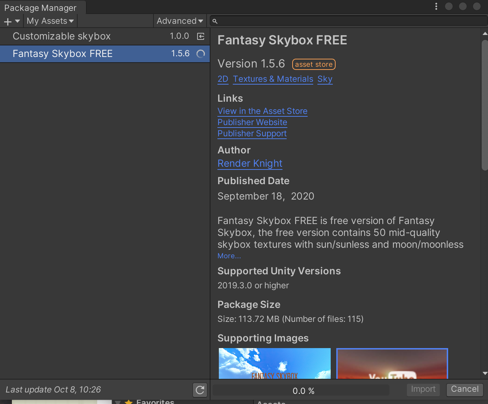

  导入后就会出现以下文件夹：

  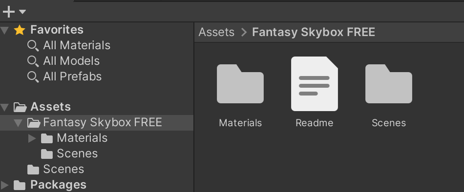

  

  然后创建Material，对应的Inspector中的Shader选Skybox->Cube map，然后选择下载好的天空图：

  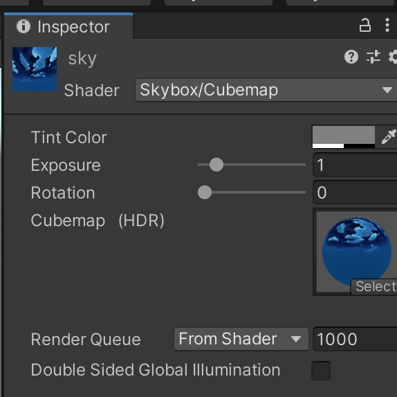

  接下来选摄像机，增加组建Rendering -> Skybox，然后把制作好的Material拖入：

  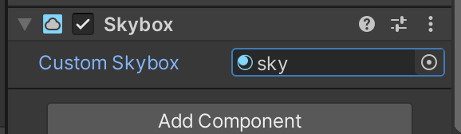

  然后创建地形，可以直接拉取Fantasy Skybox Free里的地形Sample Terrain，并种一些花花草草树木：

  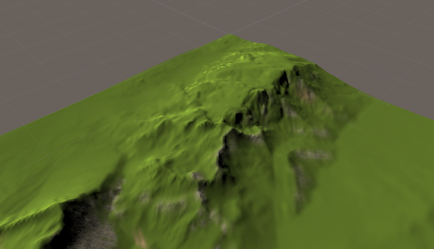

  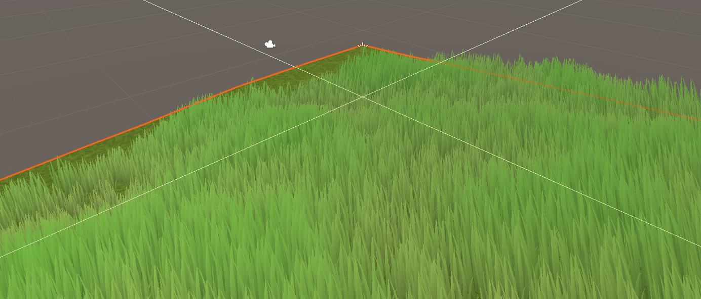

  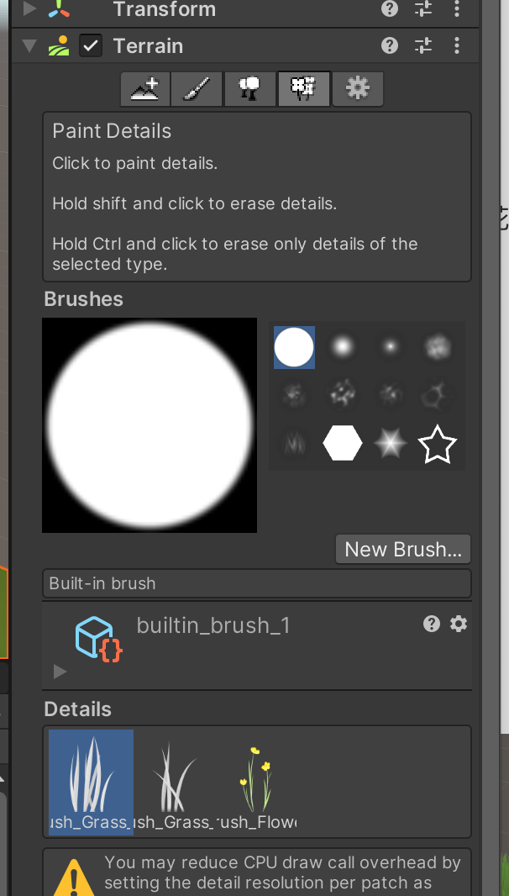

  最后调整一下摄像机的位置，游戏场景如图：

  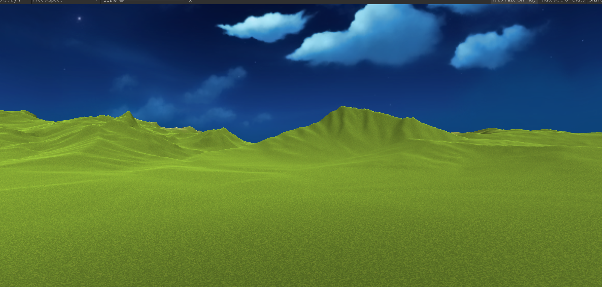

  

- 写一个简单的总结，总结游戏对象的使用

  Unity3D种游戏对象除了3D和2D的区分外，大致有以下几个主要类别：

  * 摄像机、光线等游戏辅助对象：对场景的设置起辅助作用；
  * Cube、Sphere等游戏实体对象：实现主要的游戏操作等；
  * Terrain，skybox等游戏场景对象：对游戏场景进行建设。

  通过对这些对象属性、组件和脚本的设置等，进行一系列的设置及操作，进而完成一款游戏的制作。

  

2、编程实践（二选一）

- 牧师与魔鬼 动作分离版

  *游戏源代码位于[./hw04_PriestsAndDevils_v2](./hw04_PriestsAndDevils_v2)文件夹下*

  动作分离实现思路：新增动作管理器对象，用来管理场景中的所有动作。实现在[Action.cs](./hw04_PriestsAndDevils_v2/Assets/Scripts/Actions.cs)中

  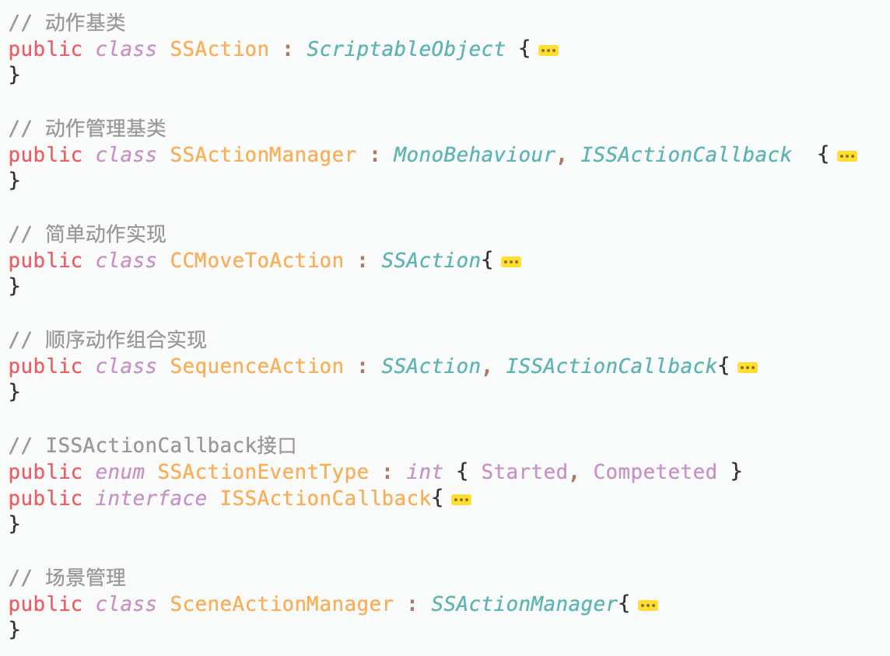

  

  - 【2019开始的新要求】：设计一个裁判类，当游戏达到结束条件时，通知场景控制器游戏结束

    裁判类：改写Controller.cs中的Check函数，在Model.cs中添加Judgement类，然后在Controller.cs里调用该裁判类判定。

    ```csharp
    public class Judgement{
        private LandController land_start;
        private LandController land_end;
        private BoatController boat; 
    
        public Judgement(LandController lstart, LandController lend, BoatController b) {
            this.land_start = lstart;
            this.land_end = lend;
            this.boat = b;
        }
    
        public int Check() {
            int start_priest = 0;
            int start_devil = 0;
            int end_priest = 0;
            int end_devil = 0;
    
            start_priest += (land_start.GetObjectsNum())[0];
            end_priest += (land_end.GetObjectsNum())[0];
            start_devil += (land_start.GetObjectsNum())[1];
            end_devil += (land_end.GetObjectsNum())[1];
    
            // win
            if (end_priest + end_devil == 6)        
                return 3;
    
            int[] boat_num = boat.GetObjectsNum();
    
            if (boat.GetBoatSign() == 1) {             // on destination
                start_priest += boat_num[0];
                start_devil += boat_num[1];
            } else {                                   // at start                               
                end_priest += boat_num[0];
                end_devil += boat_num[1];
            }
    
            // lose
            if ((start_priest > 0 && start_priest < start_devil) || (end_priest > 0 && end_priest < end_devil)) { //失败
                return 2;
            }
            // not finish
            return 1;                           
        }
    }
    ```

  [试玩视频./video/hw4_PriestsAndDevils](https://github.com/wangw42/wJuniorHomework/blob/master/3DGame/video/hw4_PriestsAndDevils.mov)

  

3、材料与渲染联系【可选】

（简单做了下）

- Standard Shader 自然场景渲染器。
  - 阅读官方 [Standard Shader](https://docs.unity3d.com/Manual/shader-StandardShader.html) 手册 。
  
  - 选择合适内容，如 [Albedo Color and Transparency](https://docs.unity3d.com/Manual/StandardShaderMaterialParameterAlbedoColor.html)，寻找合适素材，用博客展示相关效果的呈现
  
    新建材料，修改其Albedo、Metallic等属性进行渲染
  
    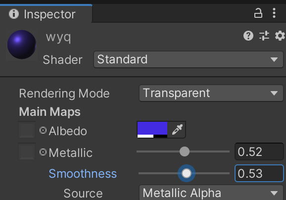

- 声音
  - 阅读官方 [Audio](https://docs.unity3d.com/Manual/Audio.html) 手册
  
  - 用博客给出游戏中利用 Reverb Zones 呈现车辆穿过隧道的声效的案例
  
    [汽车声音效果下载](https://assetstore.unity.com/packages/audio/sound-fx/transportation/i6-german-free-engine-sound-pack-106037)，下载后选择一个导入：
  
    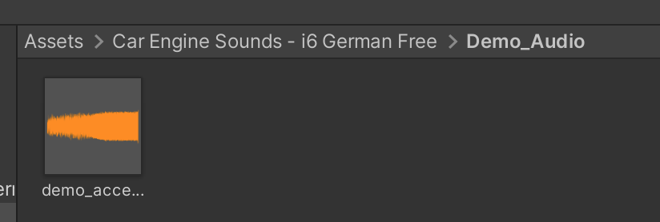
  
    导入后给先汽车添加Component中Audio的Audio Scource，然后把导入好的音效挂在AudioClip中：
  
    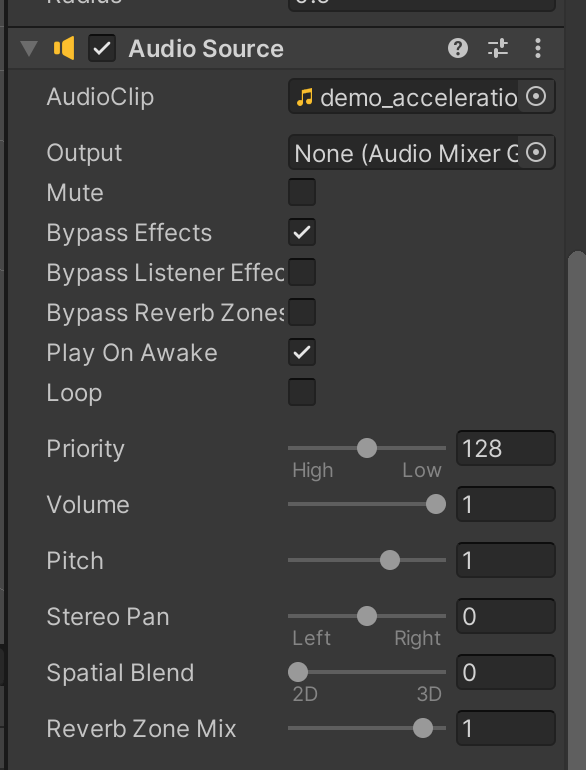
  
    隧道效果的实现可以通过给汽车再添加一个Audio Reverb Zone组件实现，选择其中Reverb Preset为Cave即可：
  
    ​		

<br><br><br><br><br>

[参考博客](https://blog.csdn.net/kjhmh2/article/details/101771523)