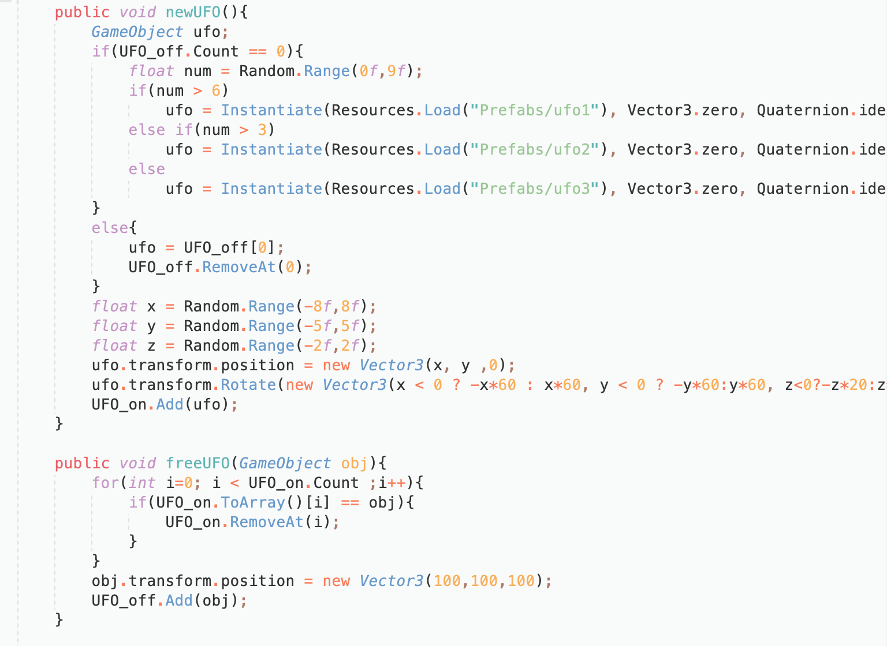
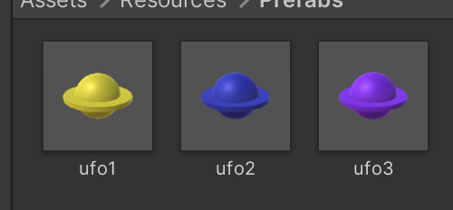

# 作业5: 鼠标打飞碟（Hit UFO）游戏

源码：[鼠标打飞碟](./hw05_HitUFO)

### 鼠标打飞碟（Hit UFO）游戏

1、编写一个简单的鼠标打飞碟（Hit UFO）游戏

- 游戏内容要求：

  已满足下列要求，可在游戏[试玩视频](https://github.com/wangw42/wJuniorHomework/blob/master/3DGame/hw05_HitUFO/hw05_HitUFO.mov)中查看

  1. 游戏有 n 个 round，每个 round 都包括10 次 trial；
  2. 每个 trial 的飞碟的色彩、大小、发射位置、速度、角度、同时出现的个数都可能不同。它们由该 round 的 ruler 控制；
  3. 每个 trial 的飞碟有随机性，总体难度随 round 上升；
  4. 鼠标点中得分，得分规则按色彩、大小、速度不同计算，规则可自由设定。

- 游戏的要求：

  - 使用带缓存的工厂模式管理不同飞碟的生产与回收，该工厂必须是场景单实例的！具体实现见参考资源 Singleton 模板类

    - 工厂类：在工厂类中进行UFO的生产和回收

      

      使用提前设置好的预制UFO，另外根据题的要求，对UFO的颜色和大小也都有设置

      

    

  - 近可能使用前面 MVC 结构实现人机交互与游戏模型分离

    

### 编写一个简单的自定义 Component 

2、编写一个简单的自定义 Component （**选做**）

- 用自定义组件定义几种飞碟，做成预制
  - 参考官方脚本手册 https://docs.unity3d.com/ScriptReference/Editor.html
  - 实现自定义组件，编辑并赋予飞碟一些属性

如果你想了解跟多自定义插件或编辑器的话题，请参考：[Unity3d自定义一个编辑器组件/插件的简易教程](http://gad.qq.com/article/detail/22497)

 

自定义的3个[UFO预置](https://github.com/wangw42/wJuniorHomework/tree/master/3DGame/hw05_HitUFO/Assets/Resources/Prefabs)，对其设置了不同的大小，贴了不同颜色的材料

