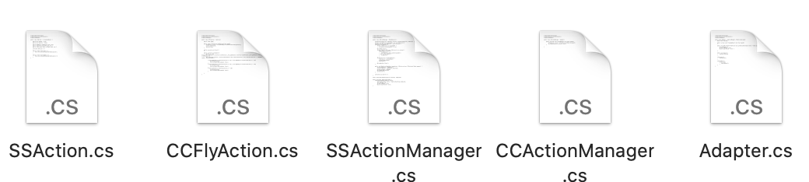

## # 作业6:改进Hit UFO游戏

1、改进飞碟（Hit UFO）游戏：

- 游戏内容要求：

  1. 按 *adapter模式* 设计图修改飞碟游戏

     

     

  2. 使它同时支持物理运动与运动学（变换）运动

2、打靶游戏（**可选作业**）：

- 游戏内容要求：
  1. 靶对象为 5 环，按环计分；
  2. 箭对象，射中后要插在靶上
     - **增强要求**：射中后，箭对象产生颤抖效果，到下一次射击 或 1秒以后
  3. 游戏仅一轮，无限 trials；
     - **增强要求**：添加一个风向和强度标志，提高难度

