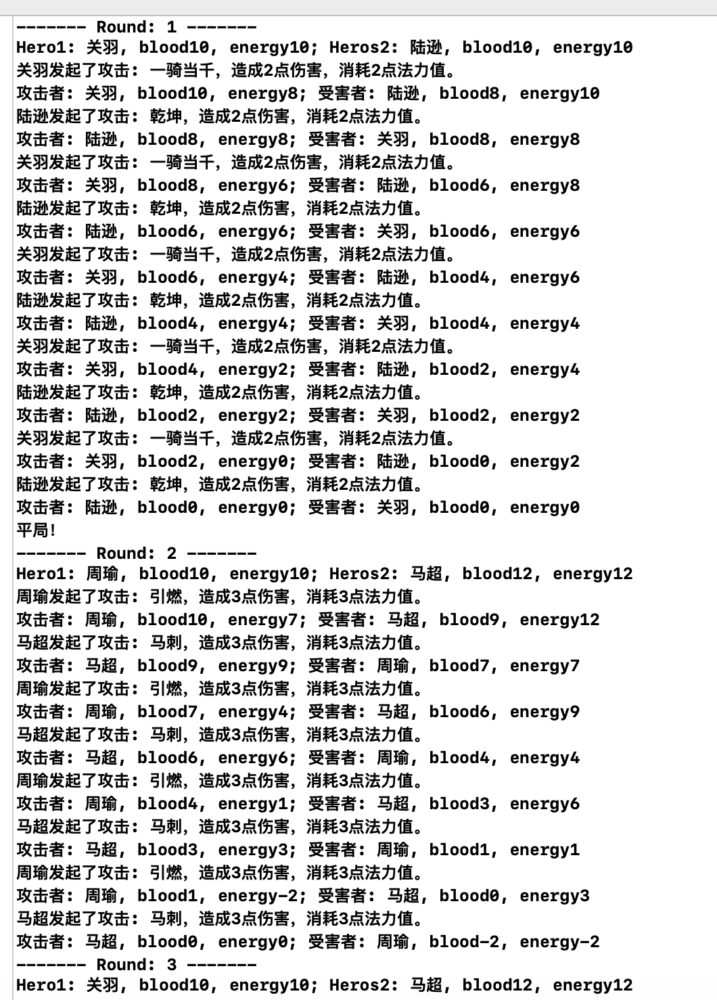
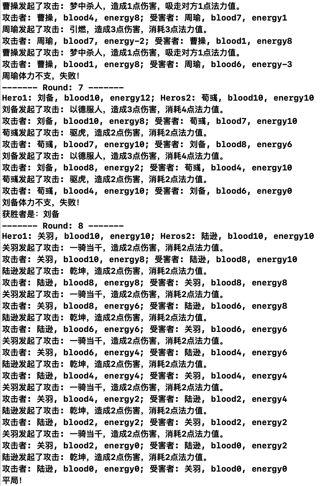

# MOSAD_HW1 Report

**作业内容**

- 安装配置Mac OS和Xcode

- 熟悉Mac OS按键操作

- 熟悉Xcode项目结构，编译运行第一个Xcode项目，项目创建流程详见[tutorial](https://gitee.com/code_sysu/mosad_hw1/blob/master/manual/tutorial.md)

  直接按照老师给的步骤完成后，运行会报错

  > Thread 1: Exception: "-[AppDelegate setWindow:]: unrecognized selector sent to instance 0x600001b3b0

  在AppDelegate.h里加声明window后解决：

  

  运行结果：

  

  

- 选取并设计N（N>10）个三国英雄

实现场景输出（log形式即可）：随机选择两名英雄，挑战M（M<=10）个回合，其中每个回合各英雄可发动不同技能，从而导致不同的结果发生（英雄各属性变化及每个回合的输赢）。

要求：

- 输出随机选择的英雄及其关键属性，输出单挑中每回合的过程、结果，以及最终胜负结果
- 需要用到多态
- 输出程序设计和运行过程中，相关设计体现的oo特性（数据隐秘性、封装性、继承、多态）

验收要点：

- 输出随机选择的英雄及其关键属性，输出单挑中每回合的过程、结果，以及最终胜负结果

- 类的设计与封装

- 类与类之间的继承关系与多态的体现

  

#### 作业运行结果

